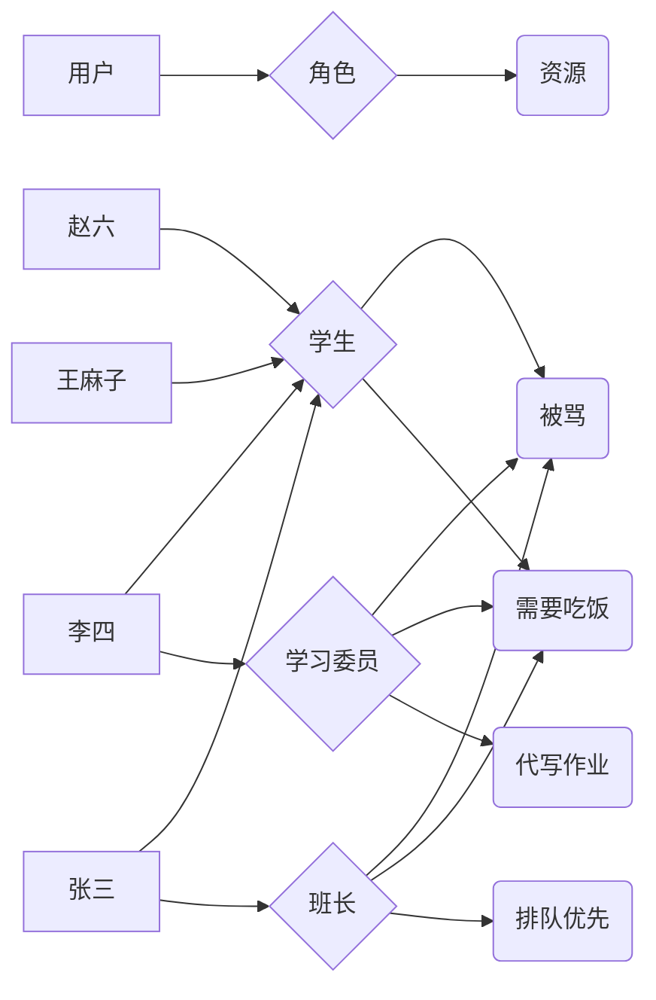

# CAS 资源及权限管理

## 模块定位
 管理系统的资源信息，用户信息，及权限信息。打造一个通用的资源权限管理体系。

## 名词解释
- 资源：将整个系统的每一个菜单，每一个按钮，都抽象成一个对象，这个对象就叫资源。
- 资源树：将所有资源类比成一棵树。树有 根/杆/枝/叶，类比资源的结构，叫资源权。资源树表明了资源之间的关系。
- 角色：类比电影中的角色，一个角色可以有很多资源。同一个角色可以由一个人担任，也可以由多个人担任。角色也可以认为是岗位。
- 角色树：所有角色的关联关系，类比资源树。
- 用户：在电影中，一个用户（演员），是一个真实的存在，可以只演一个角色，也可以演多个角色。
- RBAC 权限模型：基于角色的权限控制模型。下面重点详解

## RBAC 权限模型
> RBAC  是基于角色的访问控制（Role-Based Access Control ）在 RBAC  中，权限与角色相关联，用户通过成为适当角色的成员而得到这些角色的权限。这就极大地简化了权限的管理。这样管理都是层级相互依赖的，权限赋予给角色，而把角色又赋予用户，这样的权限设计很清楚，管理起来很方便

可参考：https://shuwoom.com/?p=3041

###  模型图

### 权限描述

- 张三是班长
- 李四是学习委员
- 所有的人都是学生
- 班长排队优先
- 学习委员需要帮代写作业
- 所有的职位都需要吃饭，也都会被骂

以上权限描述，都有一个中间关系：角色。给定任何一个人。都能知道他的角色。给定任何一个角色，都能知道他涉及的事。从而，可以确认任何一个人涉及的事。

## 权限模型设计

这里的权限模型设计，只包含 RBAC 关键设计。附属设计将在后面具体功能再做说明 

### 表设计
- 用户表 cas_user, 包含用户的基本信息。一条数据代表一个用户
- 角色表 cas_role, 记录所有角色信息。角色也可以看做是岗位
- 资源表  cas_resource, 将整个系统的所有菜单，按钮抽象出来的资源信息。包含父子关联关系，可以用父子关联关系还原成一个资源树   
- 用户-角色 关联表 cas_user_role, 记录用户所拥有的角色
- 角色-资源 关联表  cas_role_resource, 记录 角色与资源的关联关系

### 功能设计

#### 用户管理【用户增删改查，用户授权角色，查看用户的资源】
#### 角色管理【角色增删改查，角色绑定资源，角色授予用户】
#### 资源管理【资源增删改查，资源授予角色，查看有资源的用户】

## 跨域登录传递

- 行业解决方案：登录与登出动作， 都跳转到单点登录进行，在单点登录页面授权到各系统。
- 若项目不够大，需要使用单点登录方案进行，需要对登录页面独立维护，将增加工作量，故设计出以下单体项目方案：
  1. 前部使用统一方法处理在各域名之间的跳转
  2. 前端在做地址跳转前，请求后端，获取临时 token (有效次数只有一次，且有效期只有1分钟)
  3. 前端将临时 token 带到 url上，进行跳转
  4. 在跳转后，用临时token 向服务器请求，获取正式 token (此时服务器的临时token 会销毁)
  5. 将正式 token 保存至 localStorage, 并移除 url 上的临时 token
