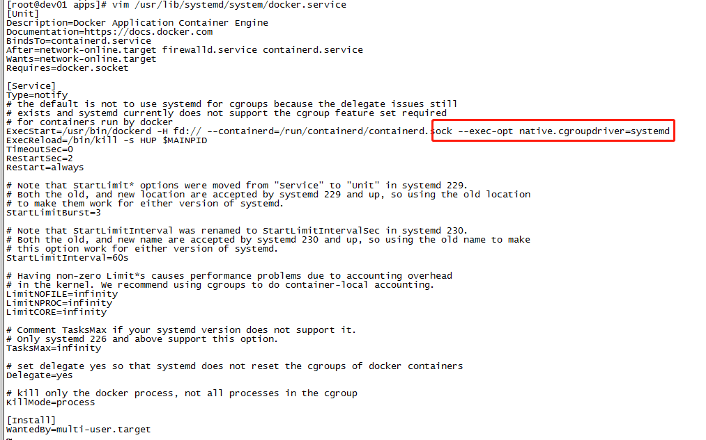

# K8S

## 系统

- CentOS 7.x


## 安装 docker

```shell script
# 卸载旧版本：
yum remove docker docker-client docker-client-latest docker-common docker-latest docker-latest-logrotate docker-logrotate docker-engine
# 使用 Docker 仓库进行安装
# 安装所需的软件包。yum-utils 提供了 yum-config-manager ，并且 device mapper 存储驱动程序需要 device-mapper-persistent-data 和 lvm2。
yum install -y yum-utils device-mapper-persistent-data lvm2
# 使用以下命令来设置稳定的仓库。
yum-config-manager --add-repo https://download.docker.com/linux/centos/docker-ce.repo
# 使用以下命令来设置稳定的仓库。
yum install -y docker-ce docker-ce-cli containerd.io

systemctl start docker
systemctl enable docker
```


## keepalived安装 【可不可以不使用】

```shell script
yum install -y keepalived
```

## keepalived 配置 【可不可以不使用】

```shell script
# vim /etc/keepalived/keepalived.conf

global_defs {
   router_id dev_master_01
}
vrrp_instance dev001 {
    state MASTER 
    interface ens160
    virtual_router_id 50
    priority 100
    advert_int 1
    authentication {
        auth_type PASS
        auth_pass 1111
    }
    virtual_ipaddress {
        172.12.12.250
    }
}
```


## 安装 K8S

 ```shell script
vim /etc/sysctl.conf
add:
vm.swappiness = 0  #     （尽量不使用交换分区，注意不是禁用）
net.ipv4.ip_forward = 1
net.bridge.bridge-nf-call-ip6tables = 1
net.bridge.bridge-nf-call-iptables = 1
:wq


swapoff -a && swapon -a  # 可以执行命令刷新一次SWAP（将SWAP里的数据转储回内存，并清空SWAP里的数据）
sysctl -p  #  (执行这个使其生效，不用重启)


# vim /etc/yum.repos.d/kubernetes.repo
[kubernetes]
name=Kubernetes
baseurl=https://mirrors.aliyun.com/kubernetes/yum/repos/kubernetes-el7-x86_64
enabled=1
gpgcheck=1
repo_gpgcheck=1
gpgkey=https://mirrors.aliyun.com/kubernetes/yum/doc/yum-key.gpg https://mirrors.aliyun.com/kubernetes/yum/doc/rpm-package-key.gpg
:wq


yum clean all
yum makecache
yum install -y kubelet kubeadm kubectl

# 修改docker Cgroup Driver为systemd
vim /usr/lib/systemd/system/docker.service
添加 【见下图】 ： --exec-opt native.cgroupdriver=systemd


systemctl start kubelet
systemctl enable kubelet


kubeadm init --image-repository registry.aliyuncs.com/google_containers


# 启动没成功

# 启动失败， journalctl -xefu kubelet 可以看到错误详情
```



## 依赖

```shell script
yum install -y golang

# vim /etc/profile.d/go.sh

# GOROOT
export GOROOT=/usr/lib/golang
# GOPATH
export GOPATH=/opt/go/Work/
# GOPATH bin
export PATH=$PATH:$GOROOT/bin:$GOPATH/bin
:wq

source /etc/profile
```


## 安装 wayne【下载失败】

```shell script
go get github.com/Qihoo360/wayne

1.创建数据库
CREATE DATABASE `wayne` CHARACTER SET utf8 COLLATE utf8_general_ci;
GRANT ALL PRIVILEGES ON wayne.* TO 'lz'@'%'  WITH GRANT OPTION;
FLUSH PRIVILEGES;
2.生成创建表结构 SQL
make sqlall
3.生成数据库初始化 SQL
make initdata

```
